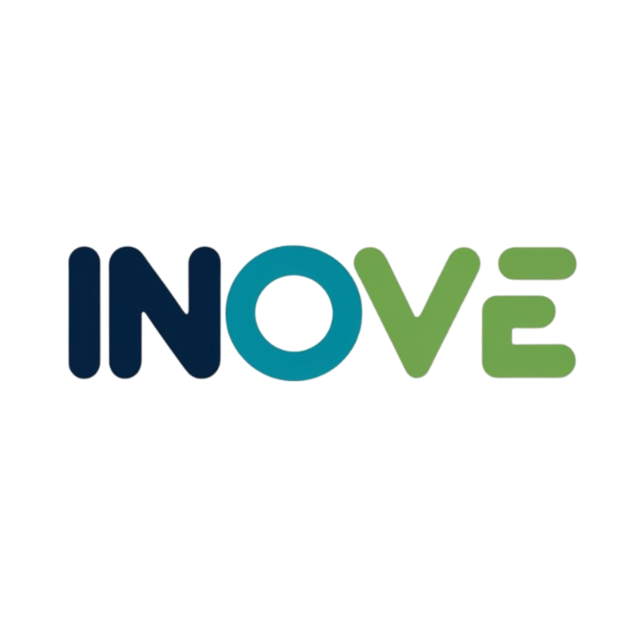

# INOVE

## Inovação Online para Vivências Educacionais

#### Logo do Projeto



#### Contextualização

No cenário educacional atual, a utilização de ferramentas de ensino e metodologias inovadoras tem se mostrado cada vez mais essencial para promover uma experiência de aprendizado efetiva e engajadora. Este projeto surge da necessidade de acompanhar o avanço tecnológico e inovar no processo de ensino.

#### Objetivo do Projeto

O objetivo do projeto INOVE é desenvolver uma plataforma educacional online voltada especificamente para professores, proporcionando ferramentas inovadoras e metodologias pedagógicas mais ativas e personalizadas.

#### Resultados esperados

1. **Capacitação de Professores**  
   - Os professores participantes serão formados para utilizar ferramentas de ensino e metodologias inovadoras, ampliando suas competências pedagógicas. Como resultado, espera-se que se sintam mais preparados e motivados a adotar práticas mais criativas e eficientes em suas aulas, promovendo um ambiente de ensino mais dinâmico e atualizado.

2. **Melhoria da Experiência de Ensino e Aprendizagem**  
   - Com a aplicação das ferramentas inovadoras em sala de aula, projeta-se uma transformação na forma como alunos e professores interagem. Os alunos terão uma participação mais ativa e colaborativa, facilitando uma aprendizagem mais significativa e duradoura, ao mesmo tempo em que se promove um clima de motivação e engajamento.

3. **Avaliação da Efetividade das Metodologias**  
   - O projeto inclui uma avaliação contínua das ferramentas implementadas, visando medir sua contribuição para o processo de ensino-aprendizagem. Esta análise permitirá identificar práticas pedagógicas mais eficazes e fornecerá subsídios para a melhoria contínua da plataforma e do projeto como um todo.

4. **Democratização e Inclusão Digital**  
   - A plataforma educacional será disponibilizada gratuitamente, garantindo amplo acesso a recursos educacionais de alta qualidade. Dessa forma, espera-se promover a inclusão digital e educacional, ampliando as oportunidades de aprendizado para diferentes públicos e fortalecendo a democratização da educação.

5. **Disseminação dos Resultados**  
   - Os resultados obtidos ao longo do projeto serão compartilhados com a comunidade acadêmica e educacional, por meio de relatórios, publicações e eventos. Essa disseminação visa ampliar o impacto do projeto, incentivando outras instituições a adotarem práticas semelhantes e reforçando o compromisso com a inovação no ensino.

#### Nome dos Membros do Projeto

```bash
Diego Ribeiro Araújo
Flávio Diniz de Sousa
Italo Gonçalves Meireles Faria
João Gabriel de Oliveira Meireles
José Antonio Ribeiro Souto
Pedro Henrique Marques
```

#### Instruções de Uso do Projeto

#### Para executar o Sistema, siga estas etapas:

1. **Configuração do Banco de Dados:**

   - Configurar o arquivo de conexão com o banco de dados `src/main/resource/application.yml` com as credenciais do banco de dados.
   - Configurar o `username` com o usuário, e `password` com a senha do servidor de banco de dados da maquina em que a API será executada.

2. **Executar o Main Class:**

   - Abra o arquivo `InoveApplication.java` localizado em `com.ifgoiano.inove` no seu IDE.
   - Execute o método `main` na classe `Main` para inicializar o Sistema.

3. **Ao Iniciar:**
   - A base de dados será Criada automaticamente, Graças as Migrações do Flyway.
   - As operações do CRUD podem ser testadas tanto pelo Postman quanto pelo Swagger(Recomendado).
   - Link de acesso ao Swagger: `localhost:8080/swagger-ui/index.html`.
